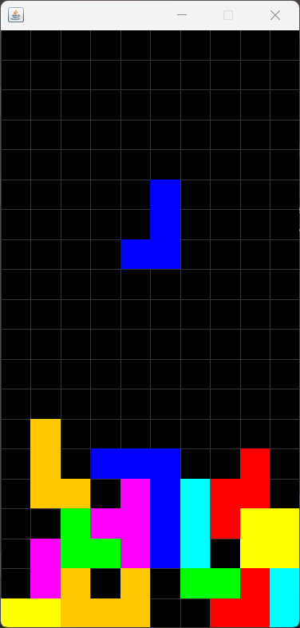

# Tetris

A classic Tetris game built from scratch in **Java** with **Swing**, implementing real Tetris mechanics such as a **7-bag randomizer** and **wall kicks** on rotation.



## Features

- Full game loop: spawning, movement, gravity, and game over
- All 7 tetrominoes (I, O, T, S, Z, J, L) with per-piece colors
- **7-bag randomizer** — pieces are drawn in shuffled bags of 7, just like modern Tetris, so you never get long droughts of the same piece
- **Rotation with wall kicks** — pieces shift away from walls and other blocks when a plain rotation wouldn't fit
- Line clearing with rows above shifting down
- Soft drop, game over detection, and a restart button

## Controls

| Key         | Action      |
|-------------|-------------|
| ← Left      | Move left   |
| → Right     | Move right  |
| ↑ Up        | Rotate      |
| ↓ Down      | Soft drop   |

## Getting started

**Requirements:** Java 17+ and Maven.

Build a runnable jar:

```bash
mvn package
```

Run it:

```bash
java -jar target/tetris.jar
```

Or run directly from Maven during development:

```bash
mvn compile exec:java -Dexec.mainClass=tetris.App
```

## Project structure

| File          | Responsibility                                                        |
|---------------|-----------------------------------------------------------------------|
| `App.java`    | Window setup, game loop, input handling, and rendering                |
| `Board.java`  | Grid state, collision checks, rotation logic, line clearing, 7-bag    |
| `Piece.java`  | A single active tetromino (position, rotation, shape)                 |
| `Puzzle.java` | Static tetromino shapes and their colors                              |


